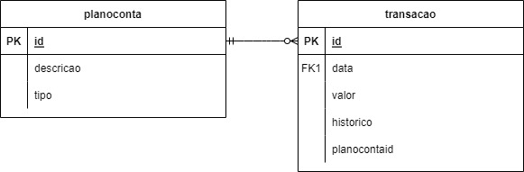
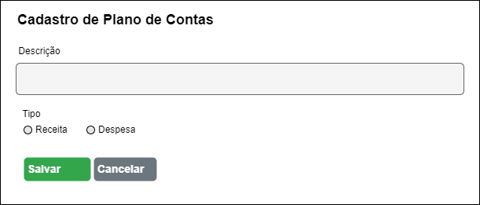
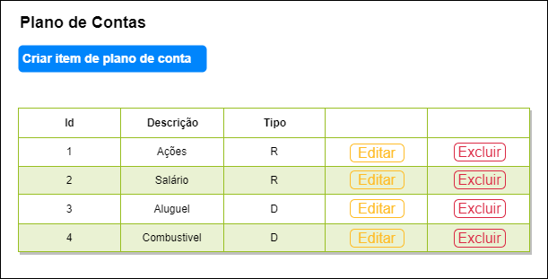
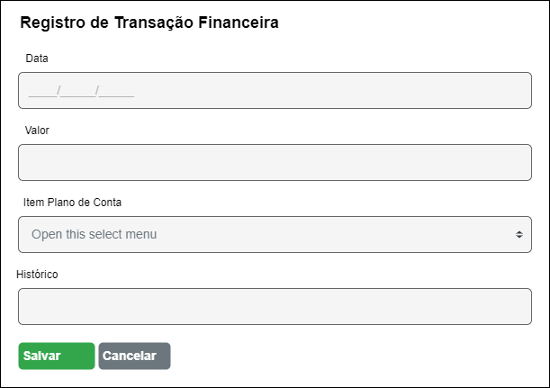

# myfinance-web-dotnet-
Myfinance - Projeto do curso de Pós graduação em Engenharia de Software

# Projeto de controle de finanças pessoais

O projeto foi desenvolvido com o objetivo de permitir que um usuário possa realizar o controle de suas finanças pessoais, e consequentemente, realizar o acompanhamento e análise dos seus gastos, servindo como ferramenta para um melhor planejamento financeiro.
 
 # Tecnologias

 ASP .NET MVC
 Sql Server

 # Banco de Dados
O banco de dados foi modelado conforme diagrama apresentado na imagem abaixo:

 # Protótipos

 Plano de contas
 
 Nessa tela é possível cadastrar um plano de conta.

Nessa tela é possível acessar as funcionalidades de cadastro, edição e exclusão de plano de conta.

Nessa tela é possível cadastrar uma transação.

Nessa tela é possível acessar as funcionalidades de cadastro, edição e exclusão de transações.

